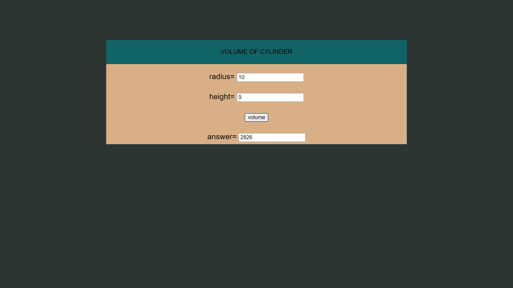
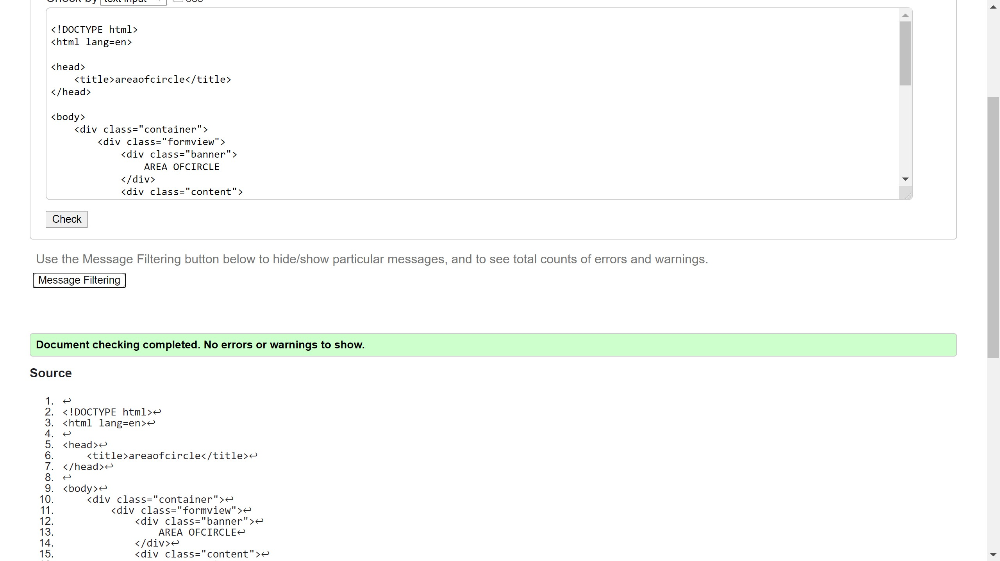
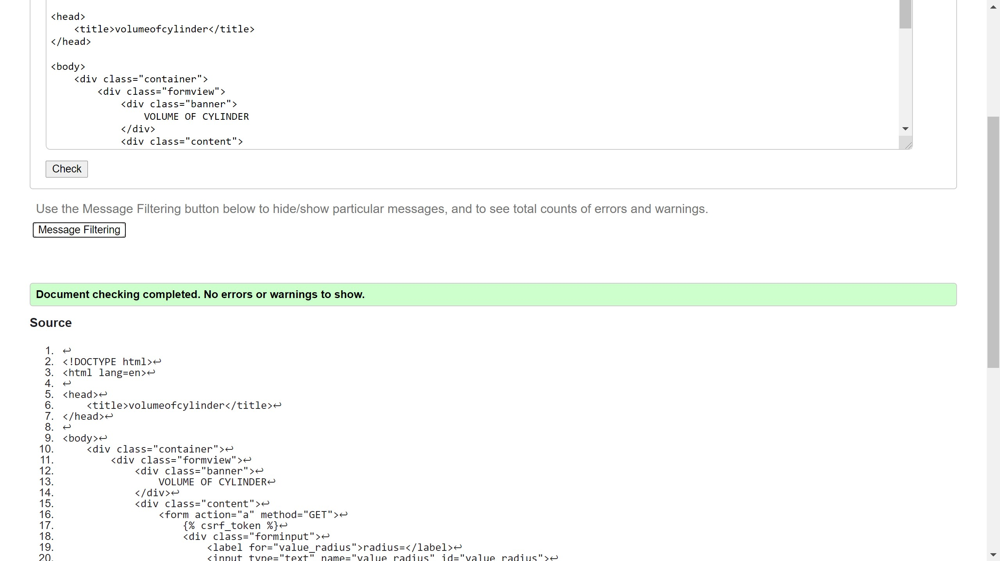

# Mathematical Calculations using JavaScript
## AIM:
To design a website to calculate the area of a circle and volume of a cylinder using JavaScript.

## DESIGN STEPS:
### Step 1: 
Requirement collection.
### Step 2:
Creating the layout using HTML and CSS.
### Step 3:
Write JavaScript to perform calculations.
### Step 4:
Choose the appropriate style and color scheme.
### Step 5:
Validate the layout in various browsers.
### Step 6:
Validate the HTML code.
### Step 6:
Publish the website in the given URL.


## PROGRAM:
## volume of cylinder html 
```

<!DOCTYPE html>
<html>

<head>
    <title>volumeofcylinder</title>
    <link rel="stylesheet" href="">
</head>

<body>
    <div class="container">
        <div class="formview">
            <div class="banner">
                VOLUME OF CYLINDER
            </div>
            <div class="content">
                <form action="" method="GET">
                    
                    <div class="forminput">
                        <label for="value_radius">radius=</label>
                        <input type="text" name="value_radius" id="value_radius">
                    </div>
                    <div  class="forminput">
                        <label for="value_height">height=</label>
                        <input type="text" name="value_height" id="value_height">
                    </div>                    
                    <div class="forminput">
                        <button type="button" name="button_volume" id="button_volume">volume</button>
                    </div>
                    <div  class="forminput">
                        <label for="value_c">answer=</label>
                        <input type="text" name="value_c" id="value_c" readonly>
                    </div> 
                </form>
            </div>
        </div>
    </div>
    <script src="/static/js/mathvolume.js"></script>
</body>

</html>
```
## volume of cylinder javescript

volumeBtn = document.querySelector('#button_volume');

volumeBtn.addEventListener('click',function(e){
    txtR = document.querySelector('#value_radius');
    txtH = document.querySelector('#value_height');
    txtC = document.querySelector('#value_c');

    let c;

    c = 3.14*parseFloat(txtR.value)*parseFloat(txtR.value)*parseFloat(txtH.value);

        txtC.value = c;
});


## area of circle html
```

<!DOCTYPE html>
<html>

<head>
    <title>areaofcircle</title>
    <link rel="stylesheet" href="">
</head>

<body>
    <div class="container">
        <div class="formview">
            <div class="banner">
                AREA OFCIRCLE
            </div>
            <div class="content">
                <form action="" method="GET">
                    
                    <div class="forminput">
                        <label for="value_radius">radius=</label>
                        <input type="text" name="value_radius" id="value_radius">
                    </div>                  
                    <div class="forminput">
                        <button type="button" name="button_area" id="button_area">area</button>
                    </div>
                    <div  class="forminput">
                        <label for="value_c">answer=</label>
                        <input type="text" name="value_c" id="value_c" readonly>
                    </div> 
                </form>
            </div>
        </div>
    </div>
    <script src="/static/js/matharea.js"></script>
</body>

</html>
```
## area of circle javascript

areaBtn = document.querySelector('#button_area');

areaBtn.addEventListener('click',function(e){
    txtR = document.querySelector('#value_radius');
    txtC = document.querySelector('#value_c');

    let c;

    c = 3.14*parseFloat(txtR.value)*parseFloat(txtR.value)

        txtC.value = c;
});

## OUTPUT:



## RESULT:




